# Agentic Design Patterns

*A single LLM call cannot look things up, cannot check its own work, and forgets everything the moment it answers. These nine patterns are how you fix that - each one shown as a diagram, a few lines of LangGraph, and its real output.*

Agent patterns are usually presented either as high-level concepts or as large framework examples. This article takes the middle path: the smallest working example of each pattern, with a diagram of its control flow alongside it.

Every example below comes from a notebook run end to end against a live model, so the outputs shown are actual results.

## 1. Why patterns at all?

A plain LLM call is a one-shot function: prompt in, text out. An agent wraps that same model in a loop with tools, memory, and a goal, so it can keep working until the goal is met.

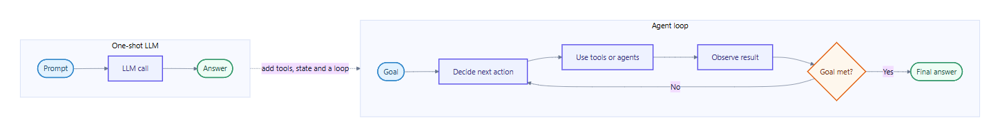

That is the whole idea. Everything else is a variation on where the loop goes and who gets to decide the next step.

Here is the honest version of why each pattern exists - every one removes a specific failure:

- Task is too big for one prompt - Prompt Chaining, Planning
- Answer is confidently wrong - Reflection
- Model has no live or private data - Tool Use
- Every request handled the same way - Routing
- Independent work runs slowly - Parallelization
- Forgets the previous turn - Memory
- One prompt juggling too many skills - Multi-Agent Collaboration
- Two plausible answers and no way to choose - Group Chat / Debate
- Risky or irreversible actions - Human-in-the-Loop

> Patterns are not frameworks. They are repeatable shapes of control flow. In LangGraph each one is a small arrangement of nodes (steps) and edges (what runs next).

## 2. The four pillars

Before the patterns, the properties that separate an agent from an ordinary program:

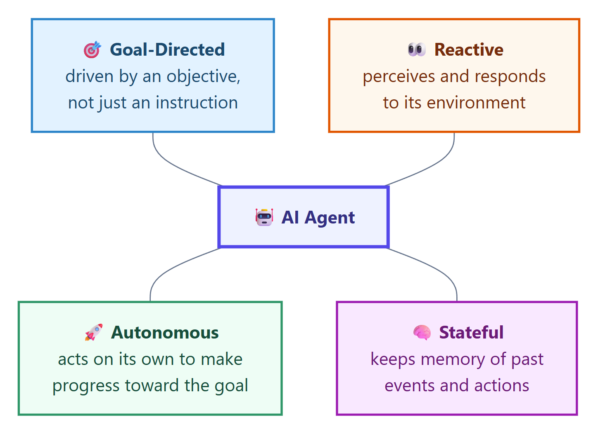

- Goal-Directed - a plain program runs fixed steps; an agent keeps working until the objective is met.
- Reactive - a plain program ignores the world; an agent reads tool results, errors, and replies.
- Stateful - a plain program forgets each call; an agent remembers the conversation and what it already tried.
- Autonomous - a plain program waits to be told; an agent decides the next action itself.

A useful one-line test: if you can replace it with an if/else and a template, it is not an agent.

## 3. The nine patterns

Each example reuses one chat model and one helper so the pattern stays visible:

```python
def ask(prompt: str) -> str:
    """Send one prompt, get plain text back."""
    return str(llm.invoke(prompt).content).strip()
```

### 3.1 Prompt Chaining

Break one big task into small steps, and feed each step's output into the next.

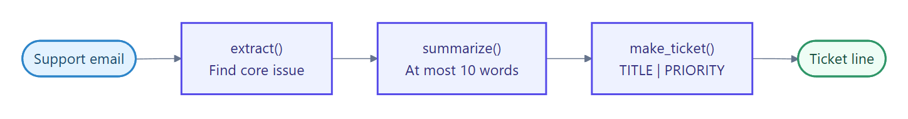

One node per step, joined by plain edges. No branching, no loop.

```python
chain = (
    StateGraph(ChainState)
    .add_node("extract", extract)
    .add_node("summarize", summarize)
    .add_node("make_ticket", make_ticket)
    .add_edge(START, "extract")
    .add_edge("extract", "summarize")
    .add_edge("summarize", "make_ticket")
    .add_edge("make_ticket", END)
    .compile()
)
```

Feeding it a rambling support email produces a clean ticket:

```text
issue   : Customer was double-charged for order #4471 last Friday and is
          requesting a refund after receiving no response to two emails.
summary : Customer seeks duplicate-charge refund for order #4471 after no response.
ticket  : Duplicate-charge refund request for order #4471 | high
```

### 3.2 Routing

Classify the request first, then send it down the branch built for it.

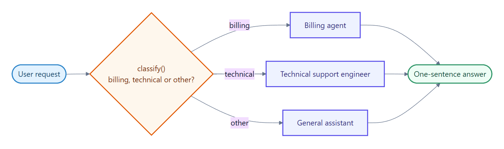

A conditional edge picks the next node from a value the classifier wrote into state:

```python
.add_conditional_edges(
    "classify",
    lambda s: s["route"],
    ["billing", "technical", "other"],
)
```

```text
I was charged twice this month.
  router -> billing

The app crashes when I upload a photo.
  router -> technical

How are you doing today.
  router -> other
```

The billing question never touches the tech-support branch. That is the saving: fewer tools in context, a tighter prompt, and a cheaper call.

### 3.3 Parallelization

Run independent sub-tasks at the same time, then merge the results.

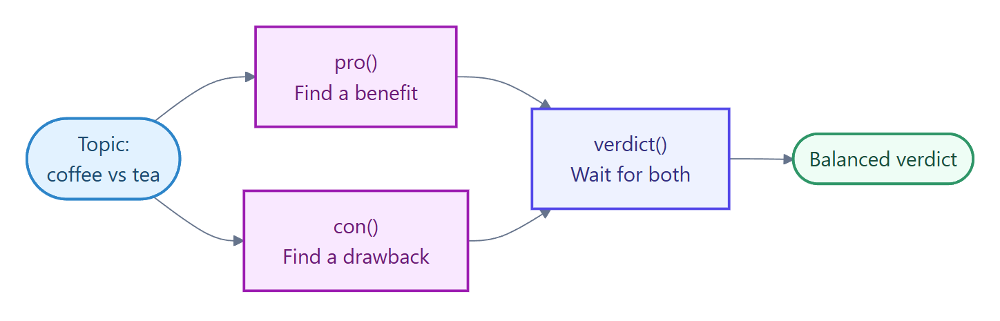

Two edges leaving START create branches that run together. The node they both feed into waits for both:

```python
.add_edge(START, "pro")
.add_edge(START, "con")
.add_edge("pro", "verdict")
.add_edge("con", "verdict")
```

The timestamps are the proof - both branches start at the same moment:

```text
pro     ran from t+0.0s to t+3.3s
con     ran from t+0.0s to t+3.8s
verdict ran after the join, total t+5.5s
```

Sequentially that is roughly 7 seconds of model time. Here it is 5.5 including the join.

### 3.4 Reflection

The agent reviews its own draft against the goal and revises until it is good enough.

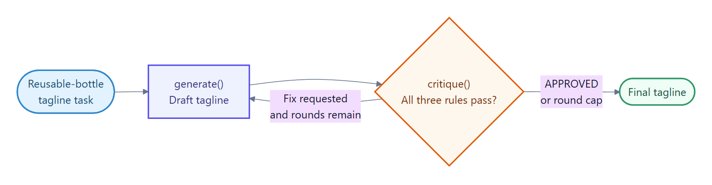

A generate node and a critique node, with a conditional edge looping back - plus a round cap, because a self-grading loop with no ceiling is how you get a runaway bill:

```python
def keep_going(state: DraftState) -> str:
    if state["feedback"].upper().startswith("APPROVED"):
        return END
    if state["round"] >= MAX_ROUNDS:
        return END
    return "generate"
```

Asking for a tagline under 8 words that mentions reuse:

```text
round 1 draft    : Refill Your Day.
round 1 critique : Add reuse mention.
round 2 draft    : Refill. Reuse. Repeat.
round 2 critique : APPROVED
```

The critic caught a real miss, and round 2 fixed it.

### 3.5 Tool Use

Give the model typed functions so it can fetch real data instead of guessing.

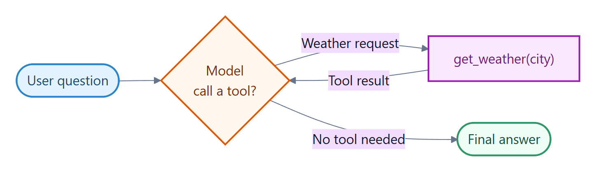

```python
@tool
def get_weather(city: str) -> str:
    """Get today's weather for a city."""
    return f"{city}: sunny, {randint(15, 30)}C"

agent = create_agent(model=llm, tools=[get_weather])
```

The interesting part is not that the tool fires - it is that the model knows when not to call it:

```text
[tool called] get_weather('Paris')
answer: Paris is sunny and 15C today.

answer: 2 + 2 = 4.          <- no tool call
```

### 3.6 Planning

Turn a vague goal into an explicit list of steps, then execute them one at a time.

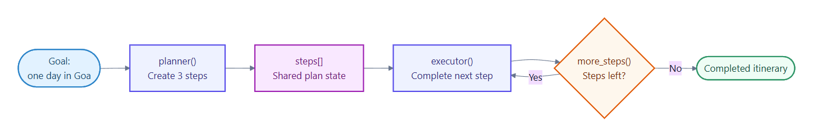

A planner writes the steps into state; an executor loops until the list is exhausted:

```python
def more_steps(state: PlanState) -> str:
    return "executor" if len(state["done"]) < len(state["steps"]) else END
```

```text
plan:
  1. Arrive early at Baga Beach
  2. Explore Fort Aguada by noon
  3. Enjoy sunset and seafood dinner

step 1 -> Reach Baga Beach by 7:00 AM for the quiet shoreline and easier parking.
step 2 -> Reach Fort Aguada by 10:00 AM; about 90 minutes for lighthouse and ramparts.
step 3 -> Head to Cavelossim for a sunset seafood dinner.
```

The plan is visible and auditable before any of it runs - which is exactly what you want when the steps have side effects.

### 3.7 Multi-Agent Collaboration

Split the work across specialists and let a supervisor decide who acts next.

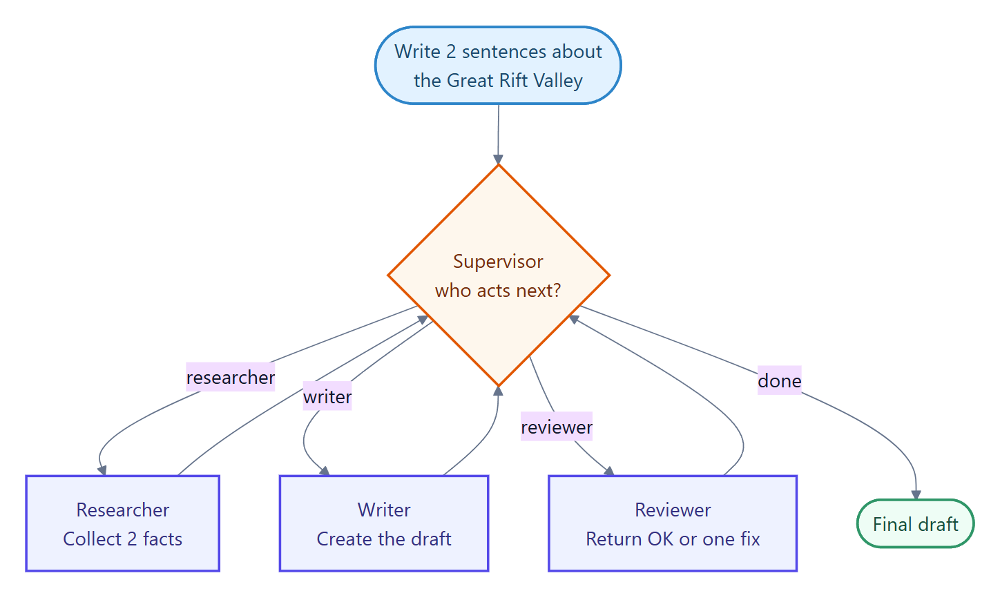

Each agent is a node; the supervisor routes with a conditional edge and shared state carries the work product:

```text
supervisor -> researcher
researcher : - The Great Rift Valley is a huge geological trench...
supervisor -> writer
writer     : The Great Rift Valley is a massive geological trench that...
supervisor -> reviewer
reviewer   : OK
supervisor -> done
```

One practical note: I kept a deterministic guard next to the supervisor so the graph stops once every worker has contributed, whatever the model says. Never let an LLM be the only thing standing between you and an infinite loop.

### Variant: Group Chat / Debate

Same cast of agents, different topology. Instead of a supervisor handing out different sub-tasks, the agents argue the same question in one shared transcript and a judge decides.

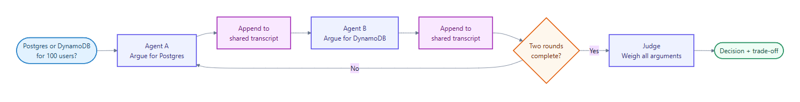

The distinction is worth being precise about:

- Reflection - one agent, talking to itself, improving its own draft.
- Multi-Agent Collaboration - specialists, working on different parts of the task.
- Group Chat / Debate - peers who disagree, working the same question to expose weak reasoning.

Asking whether a 100-user hobby app should use Postgres or DynamoDB:

```text
-- round 1 --
Agent A (Postgres): simpler to build with, cheaper to reason about...
Agent B (DynamoDB): zero-ops reliability and effortless scaling...

-- round 2 --
Agent A: at 100 users, effortless scaling solves a problem you don't have.
Agent B: avoiding small operational burdens matters more than query flexibility.

judge: Postgres - for a 100-user hobby app, ease of modeling and iteration
       matters more than DynamoDB's premature scaling benefits.
```

Round 2 is where this earns its cost. Both agents stopped pitching and started rebutting, and the judge's reasoning names the tradeoff it accepted rather than just picking a winner.

### 3.8 Memory

Preserve conversation context across turns while keeping each thread isolated.

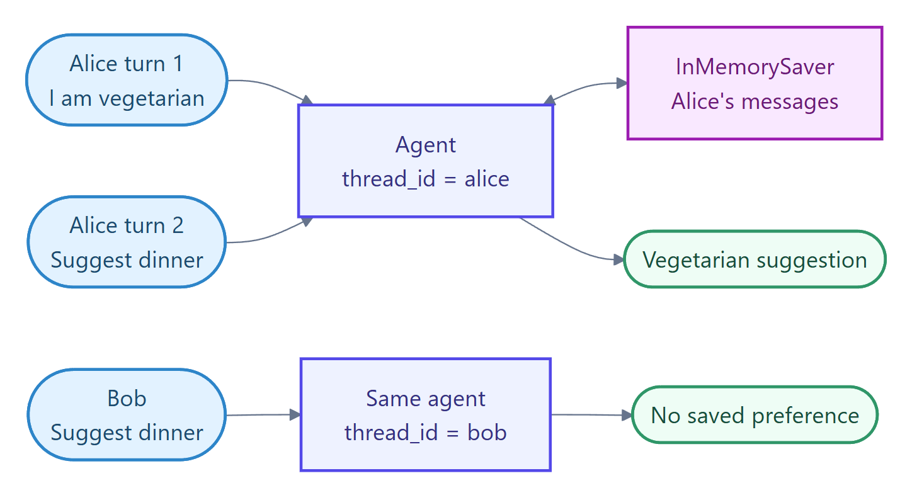

A checkpointer plus a thread_id turns a stateless agent into a remembering one:

```python
agent = create_agent(model=llm, tools=[], checkpointer=InMemorySaver())

alice = {"configurable": {"thread_id": "alice"}}
bob   = {"configurable": {"thread_id": "bob"}}
```

Alice mentions she is vegetarian once, several turns earlier. Bob never did:

```text
alice (remembers): How about a chickpea and spinach curry with basmati rice?
bob   (no memory): Try baked salmon with roasted asparagus and quinoa.
```

Same agent, same question, different thread. Isolation is the feature, not a side effect.

### 3.9 Human-in-the-Loop

Pause before risky or irreversible actions and wait for a human decision.

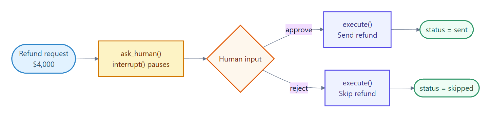

interrupt() suspends the run mid-graph; Command(resume=...) continues it from the checkpoint:

```python
def ask_human(state: RefundState) -> dict:
    decision = interrupt(
        f"Approve a refund of ${state['amount']}? (approve / reject)"
    )
    return {"status": decision}
```

The graph genuinely stops. Nothing is sent until a human answers - and because the state is checkpointed, the pause can outlive the process.

## 4. How to pick one

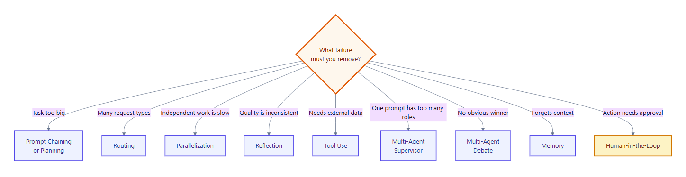

Four rules of thumb that have held up for me:

1. Start with the simplest thing that works: a single prompt, then Tool Use, then a loop.
2. Add a pattern only when you can name the failure it removes.
3. Patterns compose. A real agent is usually Routing plus Tool Use plus Memory, with Reflection on the parts that must be correct.
4. Every loop needs a stop condition: a round cap, a budget, or a human.

## A note on what the frameworks now give you

I hand-rolled these to make the control flow visible, but it is worth knowing that LangChain's create_agent now ships middleware covering several of them directly - HumanInTheLoopMiddleware, TodoListMiddleware for planning, SummarizationMiddleware for context, and ModelCallLimitMiddleware for the loop caps I wrote by hand.

Understanding the shape first still pays off. Middleware is much easier to reason about once you know which pattern it is implementing, and there is no supervisor or debate abstraction in the box - those you still assemble yourself.

## The code

The full notebook - all nine patterns, every diagram, and the setup cell - is here:

https://github.com/lastactionhero/LLM/blob/main/AgenticDesignPatterns.ipynb

It needs three environment variables in a local .env file and nothing else. Every cell runs standalone after the setup cell, so you can jump straight to the pattern you care about.

These nine are a starting set, not a closed list. Which patterns have you found useful, and what would you add?
